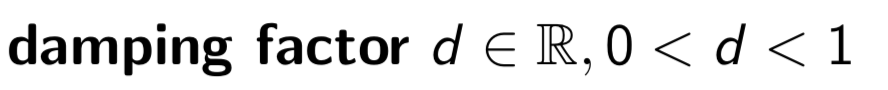

# Damping Factor 阻尼因子
***(PageRank.pdf 30页)***  

## 问题所在
* 到目前为止所有页面(dn) 的权重(authority) Xn 已经通过计算所有指向它的超链接而得出了。  
* 因此当一个页面没有任何超链指向其时 它的authority为0 
* 那如果此时有一个新的页面出现，肯定是没有任何链接指向它的，那岂不是也成0了？&nbsp;&nbsp; (╯°口°)╯(┴—┴

## 解决方案
 
 
 * D 是默认获得的authority比例(proportion of authority that a page gets by defualt)
 * D 是一个于0到1之间的实数
 * 我们说一个页面的Authority 它是由两部分组成的:  
 一. 所有超链接指向该页面所赋予的权重  
 二. 默认获得的authority