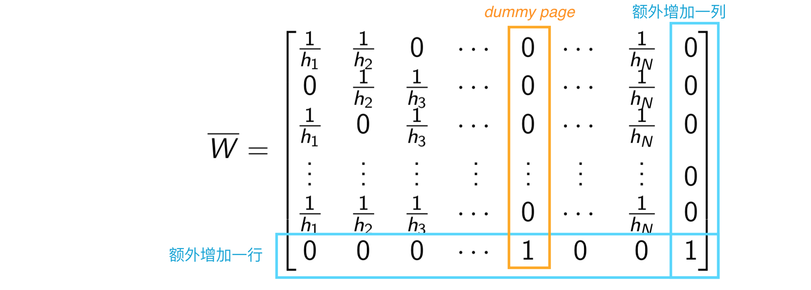

# Dangling Pages - 晃来晃去的页面：劳资不需任何文献！
***(PageRank.pdf 34页)***

## 问题所在
* 当一个页面没有任何超链接时(out)，我们把它称之为**Dangling Page**
* 当系统进入到这一页时就卡在这里出不去了
* 如果dn是一个dangling page，那么矩阵W的第n列就全部为0.
* 那么第n列之和也为0，W就不再是一个(列)随机矩阵了  
Hence the nth column sums to 0 and W is no longer a (column) stochastic matrix.
* 在上述情况发生时，我们之前所做的一些分析便不再能站得住脚 （￣へ￣）  
比如你用你的W去乘一个page rank vector的时候，结果就不再为1了

## 解决方案: Dummy Page
* 做一个傀儡页面(dummy page) **dN+1**
* 在傀儡页面dN+1 加一个超链接连到**傀儡页面本身** (self-referencing)
* 将原页面连接到这个傀儡页面上 即可解决问题  
  

* 现在来看一下新的矩阵长什么样子：

* 在末尾添加额外一列是因为当系统到最后一列后可以停留在最后一列
* W 现在是(N+1)x(N+1)矩阵了 (原本是NxN)
* 傀儡页面dN+1除了一个连到它自己的链接外 别无它链