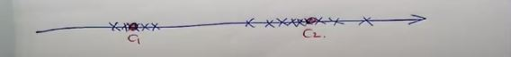
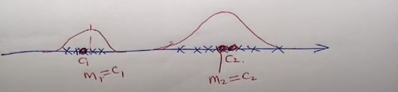

# Discrete Random Variables 

***(GMMs.pdf 第4页，Panopto: 14 March 2019 at 10:07)***

## 离散随机变量

* 假设我们有一组数据，如下图所示
* 如果我做K-means clustering的话(设k=2), 两个centroids为红点  
  

* 这组数据的分布(characterise distribution)将是下图这个样子的，点数越密集中间的部分越高  
而他们的mean, m1 m2将会和centroids c1 c2 重合
  

* K-means只能给你centroids 但这条红线可以给你更多的信息
* 除了centroids外还有数据点的分布(spread): 右边的数据密度更大，分布更广
* 这条线，就是我们要讲的 **Gaussian Mixture Model**
* 为了理解这个概念，要先回到我们熟悉的高斯分布（正态分布）
* 不单单是一维的高斯分布，我们感兴趣的是高维高斯分布(对应高维数据)