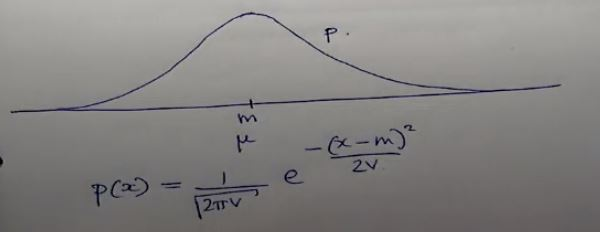
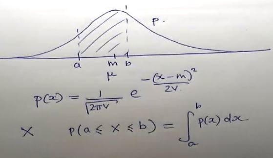

# Gaussian Random Variables 

***(GMMs.pdf，Panopto: 14 March 2019 at 10:07 (10:33))***

## 一维正态分布(一维高斯随机变量)

* 首先一团数据，中间有一个mean (通常用m或μ表示)
* 然后一个正太分布曲线，暂且称她为 p(x)

* 这个曲线 **p(x)** 的公式为如下：  
  
其中 V 是指 variance  
不要觉得她复杂，这就是个普普通通的正态分布公式╮(￣▽￣)╭
* 如果给你一个随机变量 X  
当以下情况发生时我们说这个随机变量X是高斯随机变量：  
我先随便设一个区间a和b 令X于这个区间中，那么此时它的公式为  
  

