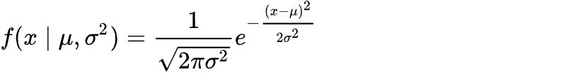
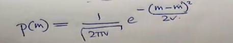
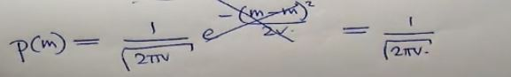
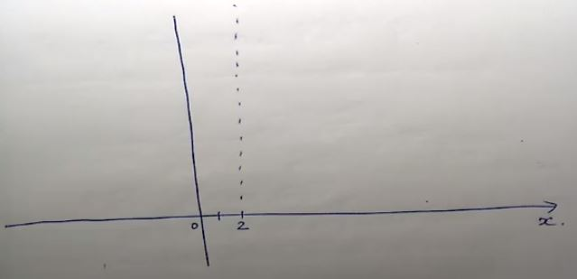
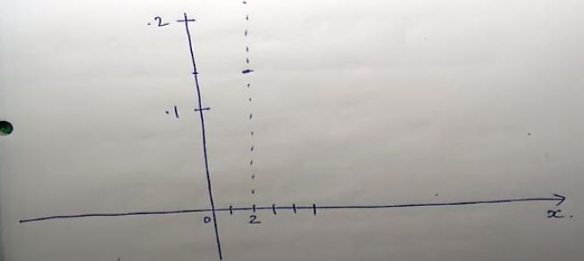

# Gaussian PDF (Probability Density Function)

***(GMMs.pdf 第9页，Panopto: 14 March 2019 at 10:07 (14:03))***

## 高斯概率密度函数

  

* 对于一个这个函数来说，存在以下属性：  
(1) 这个正负√v的范围刚好占了68%, 也就是这个区间的面积占总面积0.68 (正负√v就是**standard deviation**)  
&nbsp;&nbsp;&nbsp;&nbsp;&nbsp;68% of the area under the curve lies within +-√v  
(2) 当左右范围达到+-2√v时，这个区间的面积将占到95% (两倍standard deviation)  
&nbsp;&nbsp;&nbsp;&nbsp;&nbsp;95% of the area under the curve lies within +-2√v  
(3) 当范围达到+-3√v时，面积占用达到99% (三倍standard deviation)  
&nbsp;&nbsp;&nbsp;&nbsp;&nbsp;99% of the area under the curve lies within +-3√v  

## 公式の进化！
* 如果此时我想计算p(m)是多少，怎么算？ //p(x)中的x代表你想算的点在x轴的位置, 算出的值是对应的y的值  
根据之前的正态分布公式:  
  
(左边一坨不用管，σ == v 方差，μ == m 平均)  

   

* 我们把我们要算的x带入公式（我们要算的p(x)就是m）  

   

* 你就会惊讶的发现 m - m 为0了！ 那么直接指数部分变成e0 (e0=1)整个一坨直接消掉了  
  
公式进化の大成功！ 以后你想算p(m)时可就简单了~

## 动手做一做
* **题目: 设 m = 2; v = 9 请尽可能精准地画出曲线p**  //就是那个高斯曲线  
...╮(°∀°)  
... (°∀°)╭  
* 首先，画出mean的位置 m=2  
  
* 根据进化后的p(m)正态分布公式:
p(m) = 1/√(2πv) 我们把v=9带入进去, 得到  

* 也就是说整个曲线的中点m的高度为0.13, 画上去ε=ε=(ノ≧∇≦)ノ  

