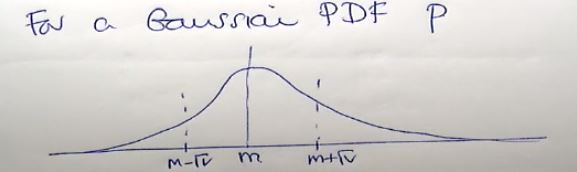

# Gaussian PDF (Probability Density Function)

***(GMMs.pdf 第9页，Panopto: 14 March 2019 at 10:07 (14:03))***

## 高斯概率密度函数

  

* 对于一个这个函数来说，存在以下属性：  
(1) 这个正负√v的范围刚好占了68%, 也就是这个区间的面积占总面积0.68 (v是variance)  
&nbsp;&nbsp;&nbsp;&nbsp;&nbsp;68% of the area under the curve lies within +-√v  
(2) 当左右范围达到+-2√v时，这个区间的面积将占到95% (两倍standard deviation)  
&nbsp;&nbsp;&nbsp;&nbsp;&nbsp;95% of the area under the curve lies within +-2√v  
(3) 当范围达到+-3√v时，面积占用达到99% (三倍standard deviation)
&nbsp;&nbsp;&nbsp;&nbsp;&nbsp;99% of the area under the curve lies within +-3√v  
(4) +-√v就是standard deviation