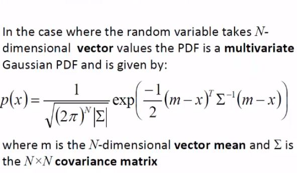

# Visualising Multivariate Gaussian PDF
***(GMMs.pdf 第11页，Panopto: 14 March 2019 at 10:07 (32:03))***

## 多方差高斯PDF的可视化
* 什么是多方差(multivariate)?  
一个维度包含一个v一个m，那么多方差指的就是多个维度咯，也就是多维度PDF可视化
  
别看公式复杂，我们只需通过一维来了解其原理，至于高维 用matlab可视化就好( •̀ ω •́ )y

## 1-standard deviation contour 最好的1&2D可视化PDF方案