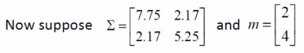
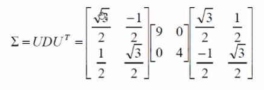

# Visualising Multivariate Gaussian PDF
***(GMMs.pdf 第11页，Panopto: 14 March 2019 at 10:07 (32:03))***

## 多方差高斯PDF的可视化
* 什么是多方差(multivariate)?  
一个维度包含一个v一个m，那么多方差指的就是多个维度咯，也就是多维度PDF可视化
  
别看公式复杂，我们只需通过一维来了解其原理，至于高维 用matlab可视化就好( •̀ ω •́ )y

 

## 最佳2D可视化PDF方案 1-Standard Deviation Contour
* 将一系列数据点分布在mean的standard deviation范围内  
The set of points that lie one standard deviation from the mean.

### 例子1:  
  
* Σ是covariance (注意在多维中是用协方差来表示)
* 可以注意到该covariance是个对角线矩阵(diagonal), 因此它的v和m是在一起的 
* 一三象限是mean，x y都是0
* 二四象限是variance，x轴方差9，y轴方差4
* 那么standard deviation(标准差)就是开方，x轴标准差3 y轴标准差2
* 直接根据标准差画图就ok了
 

### 例子2:  
然而有时候covariance Σ并不是对角线矩阵，那它的v和m就是分开的  
  
* 则需要通过PCA来计算，进行特征值分解  
  
* 中间那个对角线矩阵便是图像的variance
* 而UT则是图像旋转的角度(30o)