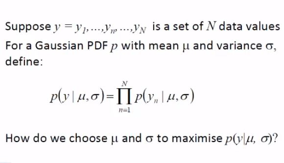
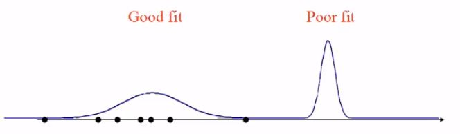
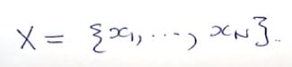
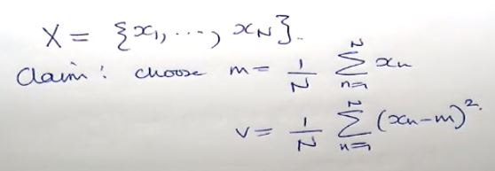
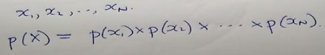
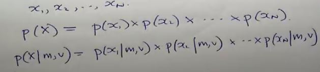
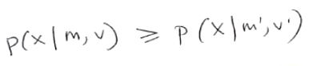
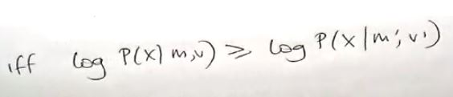
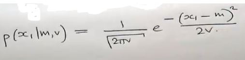
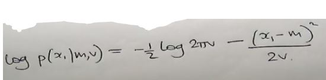

# Fitting a Gaussian PDF to Data
***(GMMs.pdf 第17页，Panopto: 14 March 2019 at 10:52 (00:23))***

## 将高斯PDF与数据组合
* 我们现在对高斯PDF有了一个初步的了解，现在想知道如何估算她的两个参数(estimate the m & v)
* **PDF有两个参数mean和variance**  
  
* 那么如何选择mean和variance才能让这个函数最大化呢？
 

## 什么叫估算参数？(What do I mean for estimate m & v)
* 假设我现在有一组数据点，如果我的图画成左边这样，这就叫good fit
* 如果是右边这样，那就是poor fit  
  
* 我想根据我的sample points获得一个好的mean和variance
 

### 例子：
* 我现在有一组数据，我想找到找到最fit这些数据的高斯PDF  
  
* 现在请从下面给出的两个m,v范围内选择一个最合适的m和v  
  
* 实际上非常简单，首先我们X的序列是这个样子的，所对应的图像p(x)是N维的  
  
* p(x)实际上是取决于方差的平均数，所以可以写成如下的形式:  
  
这个念作p(X) is given by m & v  
p(X|m,v)中的X就是概率密度函数，但我们现在想讨论的是p()中的m,v是什么函数
* 这个函数就叫做 **Likelihood of m,v** 也叫 **Likelihood Function**
* 那么选择能最大化该函数的m和v，这个叫做 **Maximum likelihood estimate of m,v** 也称为**ML estimate**

 

### 怎么找？
* 有几个小技巧
* 首先你需要知道的是, 如果以下情况发生了(图像中其中一个点x>=另一个点)  
  
那么只有可能是  
  
* 为什么要加log? 因为公式里面有e，当套用log时可以把e消除
* 还记得正态分布的公式嘛  
 
* 如果我在两边加上log后，将会变成下面的样子：  
 

