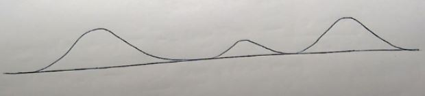
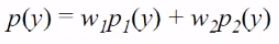
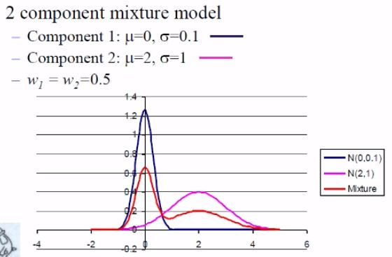
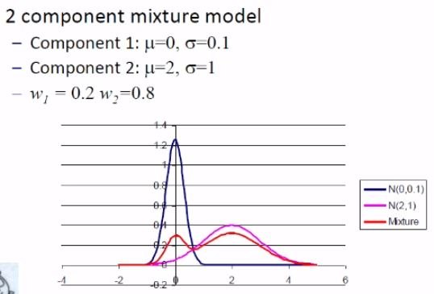
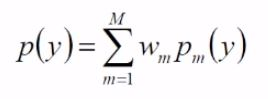
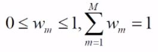

# Multi-modal Distribution & GMMs
***(GMMs.pdf 第21页，Panopto: 14 March 2019 at 10:52 (8:23))***

## 多态分布

* 现在我们了解了高斯分布，知道了怎么去画她，也知道了怎么估算一组数据的mean和variance

* 但是在现实中，如果你看看自然分布的数据的话会发现并不是像高斯曲线那样的形状(bell-shaped)

* 一个图像可能会有好几个峰值(好几个分布)，那么这个分布称之为multi-modal  
  

## Gaussian Mixture PDFs

* 高斯混合PDFs，又称高斯混合模型(GMMs)。用于多态分布和非高斯分布的建模  
Gaussian Mixture PDFs, or Gaussian Mixture Models(GMMs) used to model multi-modal and other non-Gaussian distributions.

* GMM是一个由多个PDF平衡出的权重，称之为component PDFs  
A GMM is just a weighted average of several Gaussian PDFs, called the **component** PDFs.

* 举个栗子，p1和p2都是高斯PDF，那么该公式  
  
定义了一个 2 component Gaussian mixture PDF

 

### 实物图
* 2 component 一蓝一紫，那么每个component有各自的mean和variance  

* 红色那根线就是mixture后的结果(平衡权重)，加了一半的蓝色又加了一半的红色
 

* 这是因为这两根线的weight都是0.5，如果你改变weight的话比例也会随之改变  

 

### 公式
* 一个M component的Gaussian mixture PDF由如下公式定义  
 
* 每个图像乘各自的权重，然后求和
* 对于每一个图像pm来说，她们都是处于0到1之间的  
  
并且最后总和为1

 

### GMM与Clustering的关系
* 这两个都是通过一些列的centroids/means来对数据进行建模
* 在Clustering中没有参数表示一团数据的延展(spread)，在GMM中这个参数由covariance matrix表示