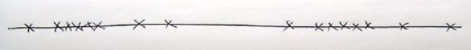
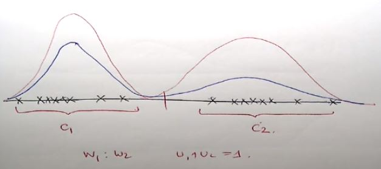

# Estimating the Parameters of a Gaussian Mixture Model
***(GMMs.pdf 第29页，Panopto: 14 March 2019 at 10:52 (19:21))***

## 估算高斯混合模型的参数

* 一个M components的高斯混合模型有以下东西：  
M 个 means: *μ1...μM*  
M 个 variances: *σ1...σM*  
M 个 mixture weights: *w1...wM*  

* 那我们如何去找到parameters呢？

### 例子
* 现在有如下一组数据，请估算出最合适这组数据的GMM  
  
* 你可能会想把这两组数据分开然后单独做参数估算，再赋予权重画新图  
  
* 问题在于，对于人脑来说很好分辨数据是两组的，但是电脑呢？怎么分辨？
* 因此就是接下来讲的  