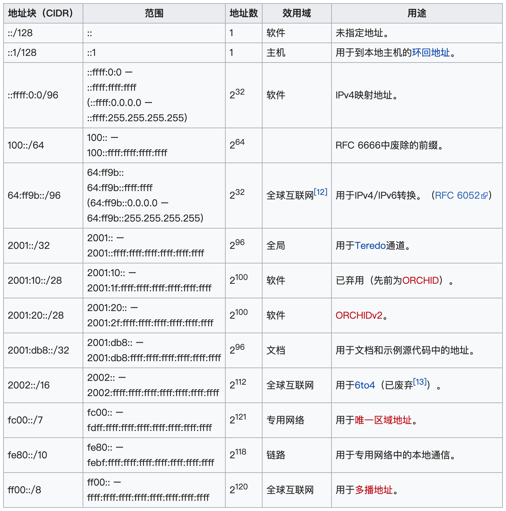

# IPv6 本质上是64位

***（Lecture5-IP.pdf 第43页，Panopto: 24 Oct 23:01)*** 

* IPv6是“真正的”64位，而不是128位，因为不会执行小于 /64的分配
* 路由表不处理任何小于 /64的网络。所有的分配必须是**4的倍数**(/64、/60、/56等等)。  
IPv6 is “really” 64 bits, not 128 bits, in that no allocations should be done which are smaller than a /64 and routing tables do not process any network smaller than a /64. All allocations must be multiples of 4 (/64, /60, /56, etc).

* 原因是，每个房子、电话、办公室至少会有/64位，这64位使得机器的地址可以随机分配或通过简单的机制来分配。  
The idea is that every house, phone, office has at least a /64, and that gives 64 bits in which addresses of a small number of machines can be allocated either randomly or by simple mechanisms

## IPv6 Reservations 保留地址

* ::/128 -"uninitialised" 未指定地址
* ::1/128 -"loopback" 回调地址，**和IPv4的1600万个地址不同**！
* ::ffff:0:0/96 -"IPv4 mapping" IPv4映射地址，用于软件
。。。。。

## IPv6 Routing Table 路由表
* 1TB是240字节，261是221 TB，这不会很快发生。 建立这样一个routing table是不现实的，需要用复杂的数据结构

### 那我们是如何路由ip的呢

* 发送方: 选择一个我们认为更接近目的地的接口，然后发送数据包  
Sender: choose an interface we believe to be closer to the  destination, and send the packet

* 接收方: 如果是我们的包，请在本地处理。否则又发送出去  
Recipient: if the packet is for us, process locally.
	* Otherwise, send it on.
* 稍后我们将更详细地讨论路由，这里只简单让你有个概念

