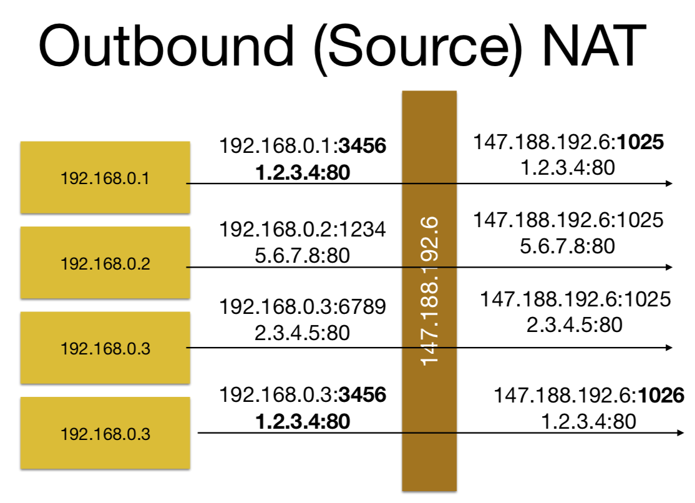
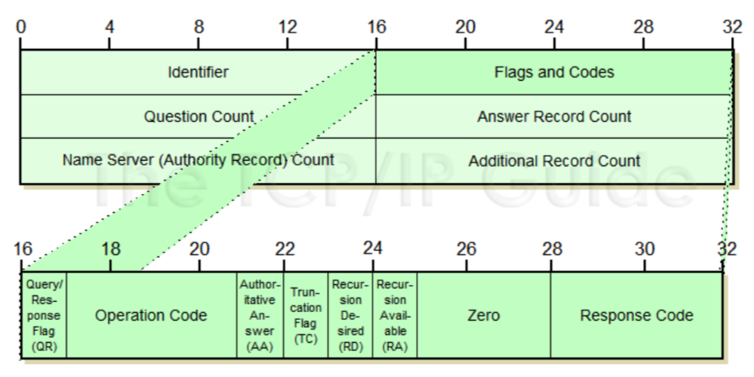

# 1. TCP和UDP
### Multiplexing / demultiplexing
* 多路复用(Multiplexing)
	* 指在一个信道上传输多路信号或数据流的过程或技术。由于multiplexing可以将多个低俗信道整合到一个告诉信道进行传输，从而有效利用了高速信道。  
	Combine multiple signals into one signal over a shared medium. The aim is to share a scarce resource.
* 多路分解(Demultiplexing)
	* Host receives IP datagrams
	* Host uses IP addresses & port numbers to direct segment to appropriate socket
		* 主机利用IP地址和端口号来引导segment到合适的socket

# 2. Networking API

# 3. HTTP (应用层)
### FTP
* 广泛的协议可用来“发送文件名，接收文件”  
Wide range of protocols available to “send a filename, receive a file”.

* 我们稍后将讨论FTP，它可能是最古老，当然也是最丑陋的

### 为什么要HTTP
* Hypertext Transport Protocol
* 最初设计用于处理支持超链接的HTML下载(“HTTP GET”)  
Originally designed to deal with downloading HTML with support for hyperlinks (“HTTP GET”)
	* 后来扩展到了很多其它范围和指令 如 HTTP POST, HTTP PUT  
Extensible to a wide range of other tasks with other commands (“HTTP POST”, “HTTP PUT”)
	* 灵活的URL概念意味着它可以执行除传送文件之外的许多其他任务 
Flexible concept of URL means that it can do many other tasks apart from shipping files

* 该端口搭建相对简单，但非常灵活  
Protocol is relatively easy to implement, but very flexible

* 由于HTTP协议简单，使得HTTP服务器的程序规模小，因而通信速度很快。

### 基本结构
* 客户端发送一些options
* 客户端发送command
* 客户端发送一个blank line
* 服务器发送status
* 服务器发送一些注释(commentary)和信息(information)
* 服务器发送一个blank line
* 服务器发送一些数据
 
### HTTPS vs HTTP
* HTTP (port 80) talks HTTP
* HTTPS(端口443)通过立即协商的TLS会话与HTTP通信。
HTTPS (port 443) talks HTTP over an immediately negotiated TLS session. 
 
 
 
# 4. NAT
##### 先简单介绍一些除了TCP和UDP外其它的端口
### RTP
* Real-time transport protocol
* 用来传输语音和视频的(在某些App中有用到)
* UDP做不了的事情RTP也不能做

#### 与TCP的区别
* No acknowledgements
* 接受者知道何时包会被发送，以及发送了多少  
Receiver knows when packet was sent, and how many were sent.

### DCCP
* Datagram Congestion Control Protocol
* UDP加一些修饰，针对对时间敏感的投递 for time-sensitive delivery

## Multipath TCP 多路TCP (新技术)
* 在一个TCP连接的情况下允许多路  
Allows mutiple paths to be used by one TCP connection.
* 例子: Wifi **and** 4G **simultaneously**

#### 多路TCP不单单是为了性能
* 通过在WiFi和4G上进行多路复用，其中一个的失效只会出现一些包丢失，而连接会迅速重新配置。  
By having a link multiplexed over WiFi and 4G, failure of one path appears as just some packet loss, and the link rapidly reconfigures.

* 还可以有效地使用多个网卡

## Address Translation 地址翻译
* 扩展稀缺的IP号码的机制  
Mechanism to extend scarce IP numbers.

* 提供了一些安全性，但并不是设计目标，需谨慎对待
* 打破了端对端理论"end to end principle"

### 基本概念
* **Outbound NAT**:
	* 从较多的IP地址编码为较少的IP地址(本地网到外网)  
	Connection is modified so that connections from multiple source IP addresses are encoded into port number space of a smaller number of addresses
* **Inbound NAT**:
	* 从较少的IP地址(外网)扩张到较多的IP地址(内网)
		* Connection is modified so that connections to multiple ports on a small number of IP addresses are expanded out to a large number of addresses
	* 用单个IP号就能提供多种服务(并且良好的支持虚拟化)  
	Used to offer multiple services from single IP number (goes well with virtualisation to minimise attack surface)
	

### TCP连接的不同由4个点来区分(identify)
* source IP, source port, destination IP, destination port
* 只要其中一个变了我们就可以说这是一个不同的连接
* source 是可以更改的

* 加粗的部分就是port
* 在现实中不需要那么复杂的port numbers

 

## NAT在TCP中的结合(重要)
* **Inbound:** 
	1. NAT设备会观测"SYN"包，并且建立一个内网与外网地址的映射  
NAT device sees “SYN” packet and builds a mapping between inside and outside addresses

	2. 修改TCP包(包括IP header，因为要更改源地址为自己的)，重新计算checksums，最后发送包  
Modifies TCP packet (including IP header, as involves change to source address to be own), recomputes check sums, sends packet

* **Outbound:**
	1. 发出：在接收到数据包后，查看源IP和端口，以及目标端口，执行反向映射，最后发送数据包  
On receipt of packets, looks at source IP and port and destination port, performs reverse mapping and sends packet.
	2. 跟踪TCP状态，当完全完成后删除翻译表中对应的条目  
	Tracks TCP state, and deletes entry from translation table when FINs have all completed
	
### NAT在UDP中的结合
* 没有“状态“; No "state as such.
* 重写发出的UDP，然后接受返回包，直到等到一段时间的间隙(10秒通常)  
Rewrite outgoing UDP and then accept return packets until there is silence for 10s (typically).
* 可以对回复的数量施加限制，例如DNS。  
Can also impose limit on number of replies, as for example DNS.

## NAT的问题
1. 对于用户的身份验证和登陆是件非常麻烦的事情  
Makes it very difficult to authenticate and log users

2. NAT日志是carrier级的，却要要求在远程服务器和NAT上进行日志的时间对齐  
NAT logging is part of "carrier grade NAT", but requires time alignment of log on remote server and at the NAT point.

#### Timing Problems
* 服务器上的时间和NAT转发后的时间会不一致
* NAT log 是不会包含URL的，只有IP号

### Logging Problems
* 大多数web日志不包含源端口  
Most web logging does not record source ports. It can, but usually doesn’t.
* 因此很难从NAT点请求日志，因为将有多个连接到相同的服务，仅通过源端口才能区分  
So very difficult to request logs from NAT point, as there will be multiple connections to the same popular service, distinguished only by source port

## NAT Security 安全性
* NAT在概念上是一个有状态防火墙:每个TCP连接都被跟踪状态，每个UDP“连接”至少被监视数量和持续时间  
NAT is conceptually a stateful firewall: each TCP connection is being tracked for state, each UDP “connection” is being at least monitored for volume and duration

* NAT产品没有经过认证或专门用于安全而设计

# 5. DNS（应用层）
* 将names映射到IP(v4和v6)，将IP映射到names，还有定位源的方法  
Absolutely fundamental to Internet: maps names to IP numbers (v4 and v6), numbers to names, locates resources

* 非常不安全 实现很复杂

* DNS形成了一个松散耦合的分布式数据库，包含成对的key/value  
The DNS forms a loosely coupled distributed database, containing key/value pairs

### Resource Records (RR sets) 源记录(RR集)
* 将name映射到数据  
Map a name to some data, plus have some book-keeping data in them.

* 简单的例子 A records是IPv4地址，AAAA记录是IPv6地址

#### TTL (Time to Live)
* 通常以秒计时，你可以将RR缓存那么长的时间
* TTL到期后名称服务器就丢弃原来的缓存信息并从权威服务器获取新的数据(才这个时间内如果没有相应的访问就丢弃缓存)
* TTL过长，当记录发生变更时无法及时传达，TTL过短，导致频繁请求上层权威，增大解析时常。

## DNS Components 包含的内容
* **Clients**
	* 向递归服务器询问然后接收回应  
	ask questions to recursive servers and receive answers
* **Recursive Servers**
	* 有时被称为缓存服务器，可以被用来提问：某某名字的IP是多少，然后会给出一个完整，但有时不权威的答案  
	(sometimes called caching servers) can be asked a complete question (“what is the address of some.machine.dom.ain?”) and will give a complete, but sometimes inauthoritative answer
	* 当它们向权威服务器解析过一次后便会缓存结果，之后的相同的问题会直接给缓存结果，直到TTL结束  
	Once they have resolved a name they can cache the result, and can answer repeated questions from the cache so long as they appropriately decrement the TTL
	* 递归服务器会为流行的域名做定期缓存，每隔TTL时间只刷新一次  
	Particularly, the recursive server will rapidly build a cache of the NS records for popular domains, only refreshed once per TTL seconds
	* 因此response的结果是分权威不权威的，看下一节的Packets
* **Authoritative Servers**
	* 有时被称为循环(iterative)服务器，仅提供他们配置范围的权威答案  
	(sometimes called iterative servers) only give **authoritative** answer about zones they are configured to know about.
		* **Masters (Primaries) **and S**laves (Secondaries)** are both **Authoritative**
	* 对于给定的域名，可能会有一个或更多nameserver在一些逻辑上更靠近根的区域  
	For a given domain, there will be one or more nameservers specified in some zone logically closer to the root (not necessarily one node up).
	* 这些指定的名称服务器对于指定的域名都是权威的  
	Each of these specified nameservers is authoritative for the specified domain
	* 指向它们的NS记录在父类中称为委托(**delegation**)  
	The NS record that points to them is called a delegation in the parent.

## DNS Packets

### 这里面的Flags
#### AA: Authoritative Answer
* 1 表示要么我是权威的，要么这个答案刚刚来自权威服务器。  0 表示它来自缓存  
1 means either I am authoritative, or this answer has freshly come from an authoritative server. 0 means it’s come from a cache.

#### TC: Truncation
* 1表示响应超过512字节，因此客户机应该建立TCP连接并以这种方式获取数据。  
1 means that there is more than 512 bytes of response, so the client should establish a TCP connection and fetch data that way.

* 如果只是“附加信息”被截短了，可能就不影响了。  
If it’s just “additional information” that has been truncated, may not bother.

#### RD, RA: Recursion Desired / Available
* Recursion desired 意思是"请完整的回答这个问题"
* Recursion Available 意思是"如果你叫我做的话，我就会做recursion"  
Recursion Available means “I would do recursion if you asked me for it”, which is worth recording

### Resource Records
* Name TTL Class Type Data
* Labels can be compressed

## DNS Client 客户机
* DNS客户机帮助使用外部DNS服务器解析DNS请求。  
A DNS Client helps to resolve DNS requests using an external DNS server.

* DNS客户机也被称为"resolvers"
* 你可以直接用libresolv的工具查询DNS

## 域名是如何被解析的
* 客户机向递归服务器询问完整信息
Clients ask recursive servers ("rd" = "recursion desired")

* 递归服务器从根节点开始，向下请求下一个标签的名称服务器，直到它们最终可以请求最后一个名称服务器提供所需的源头记录  
Recursive servers start at the root, and work downwards asking for the nameserver of the next label down, until they can finally ask the last nameserver for the required RR

### 为什么会有多个权威服务器？
* 负载平衡和冗余  Load balancing and redundancy

### 可能的攻击行为
* 老旧的 nameserver 软件会盲目的接受附加信息并将其缓存  
Old nameserver software blindly accepted additional information and cached it

* 比如提供一个 google.com 604800 IN A 1.2.3.4 ; 任何访问你nameserver的人都有机会缓存一个谷歌的bad nameserver (如果是银行网站就糟了)
* Now stopped with "out of balliwick" controls: you only accept additional information that the server can reasonably be assumed to be authoritative for.

### Dynamic Update
* 适用于信任环境中的DHCP服务器  
Useful for DHCP servers in trusting environments
	* 你可以更新DNS以反映设备进入和离开网络  
	You can update the DNS to reflect equipment entering and leaving the network
	* 通过仔细使用DHCP客户机id，允许网络上的任何人假装成其他人  
	Allows anyone on the network to pretend to be anyone else by careful use of DHCP client ids

# 6. Other Applications

# 7. 路由端口 Routing Protocols

# 8. Virtual Firewalling
* VLAN - Virtual Local Area Network 虚拟局域网
* 是指一组逻辑上的设备和用户，这些设备和用户不受物理位置的限制，可以根据功能，部门，应用等因素将它们组织起来，相互之间的通信就好像它们在同一个网段中一样，由此得名虚拟局域网

* ian给的定义：
	* 虚拟网络是物理网络上的一组标记  
	Virtual network is a set of tags on a physical network.
	
	* 在虚拟化中，VLAN是一个纯粹的软件结构 
	In virtualisation, a Virtual Network is a purely software construct
	
### VLANs on Physical Nets 在物理网中的虚拟网
* 在以太网数据包格式中插入一个额外的“标记”，说明数据包属于哪个网络。  
an extra ‘tag’ inserted into the ethernet packet format saying which network the packet belongs to. 

* 

# 9. NTP

# 	